<div align="center">
<p>
    
    
</p>
     Friendzy – Real-Time Social Media App (Flutter + Firebase + GetX)

Friendzy is a modern, real-time social media application built using Flutter, Firebase, and GetX. The app allows users to create posts, upload stories, chat live, follow and unfollow users, like and comment on content, and view real-time updates across the entire platform. This project is designed as a portfolio-grade application to demonstrate clean architecture, scalable state management, and real-time cloud database integration.

</div>


---

## 🚀✨ Features

### 🔐🔑 Authentication

* Email & Password login using Firebase Authentication
* Google Sign-In integration
* Secure session handling
* Automatic user profile creation after registration

### 👤🧑‍💼 User Profile

* Upload and update profile picture
* Set username and bio
* Real-time follower count
* Real-time following count
* Real-time post count
* Profile update timestamp using `timeago`
* Profile post grid layout
* Full-screen image preview using `photo_view`

### 📰📝 Posts System

* Create text and image posts
* Like posts in real time
* Comment on posts
* Like comments
* Real-time update of likes and comments count
* Search posts by caption or username
* Full-screen photo viewer
* Post timestamp using `timeago`

### 📸🎞️ Stories System

* Upload image stories
* Automatic story slide with progress bar
* Real-time story view count
* Like/react to stories
* Auto navigation to next user’s story
* Story timestamp using `timeago`

### 💬⚡ Live Chat System

* Real-time one-to-one messaging
* Online/offline user status
* Message delivery and seen status
* Message timestamp using `timeago`

### 🔍🧭 Search System

* Search users by username
* Search posts by content
* Instant result updates

### 🔔📢 Notifications

* Follow notifications
* Like notifications
* Comment notifications
* Real-time Firestore-based updates

### 📷🖼️ Media Handling

* Image picker for profile, posts, and stories
* Full-screen photo preview
* Profile photo grid system
* Smooth carousel sliders

---

## 🧠🏗️ Architecture Overview

The application follows a clean and scalable folder structure using GetX for state management, routing, and dependency injection.

```text
lib/
│
├── app/
│   ├── data/
│   │   ├── models/
│   │   │   ├── user_model.dart
│   │   │   ├── post_model.dart
│   │   │   ├── story_model.dart
│   │   │   └── message_model.dart
│   │   │
│   │   ├── services/
│   │   │   ├── auth_service.dart
│   │   │   ├── firestore_service.dart
│   │   │   └── storage_service.dart
│   │   │
│   ├── modules/
│   │   ├── auth/
│   │   │   ├── auth_binding.dart
│   │   │   ├── auth_controller.dart
│   │   │   └── auth_view.dart
│   │   │
│   │   ├── home/
│   │   │   ├── home_binding.dart
│   │   │   ├── home_controller.dart
│   │   │   └── home_view.dart
│   │   │
│   │   ├── post/
│   │   │   ├── post_binding.dart
│   │   │   ├── post_controller.dart
│   │   │   └── post_view.dart
│   │   │
│   │   ├── story/
│   │   │   ├── story_binding.dart
│   │   │   ├── story_controller.dart
│   │   │   └── story_view.dart
│   │   │
│   │   ├── chat/
│   │   │   ├── chat_binding.dart
│   │   │   ├── chat_controller.dart
│   │   │   └── chat_view.dart
│   │   │
│   │   ├── profile/
│   │   │   ├── profile_binding.dart
│   │   │   ├── profile_controller.dart
│   │   │   └── profile_view.dart
│   │   │
│   │   ├── search/
│   │   │   ├── search_binding.dart
│   │   │   ├── search_controller.dart
│   │   │   └── search_view.dart
│   │   │
│   │   └── notification/
│   │       ├── notification_binding.dart
│   │       ├── notification_controller.dart
│   │       └── notification_view.dart
│   │
│   ├── routes/
│   │   └── app_pages.dart
│   │
│   ├── bindings/
│   │   └── initial_binding.dart
│   │
│   └── utils/
│       ├── constants.dart
│       └── helpers.dart
│
├── main.dart
└── firebase_options.dart
```

---

## 🛠️⚙️ Technology Stack

### Frontend

* Flutter (Dart)
* GetX (State Management, Routing, Dependency Injection)
* Material UI

### Backend

* Firebase Authentication
* Cloud Firestore
* Firebase Storage

### Packages Used

```yaml
get: ^4.7.3
carousel_slider: ^5.1.1
firebase_core: ^4.4.0
firebase_auth: ^6.1.4
google_sign_in: ^7.2.0
cloud_firestore: ^6.1.2
image_picker: ^1.2.1
http: ^1.6.0
photo_view: ^0.15.0
timeago: ^3.7.1
```

---
## 📱 App Gallery

<div align="center">
  <table style="border: none;">
    <tr>
      <td align="center"><strong>Home Screen</strong></td>
      <td align="center"><strong>Home screen 2</strong></td>
      <td align="center"><strong>Sign in</strong></td>
    </tr>
    <tr>
      <td>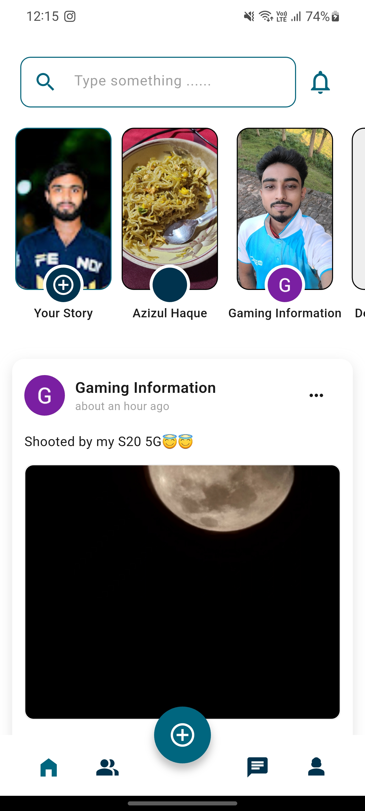</td>
      <td>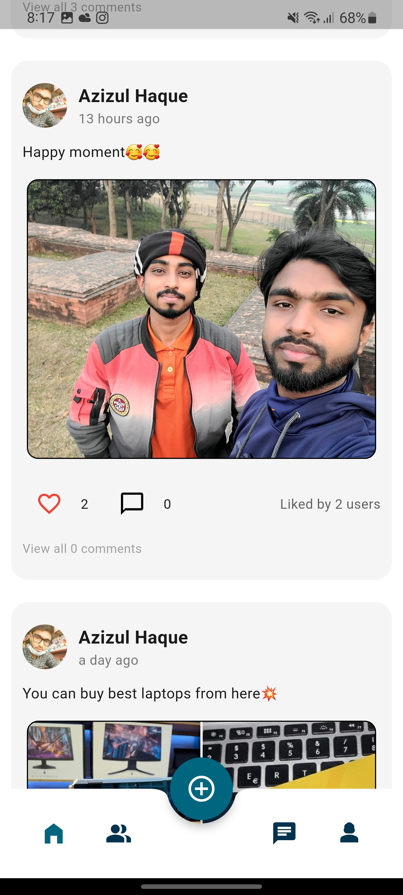</td>
      <td>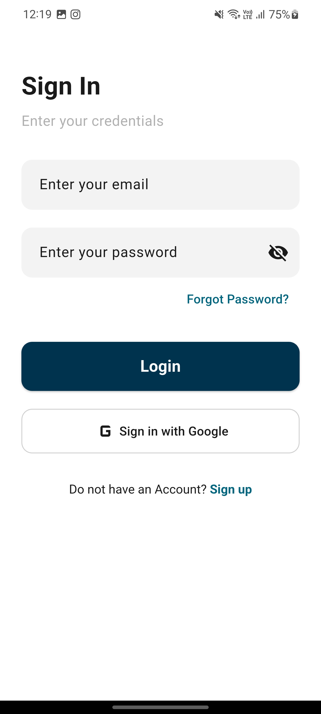</td>
    </tr>
    <tr>
      <td align="center"><strong>Post Details</strong></td>
      <td align="center"><strong>Create post</strong></td>
      <td align="center"><strong>Upload story</strong></td>
    </tr>
    <tr>
      <td>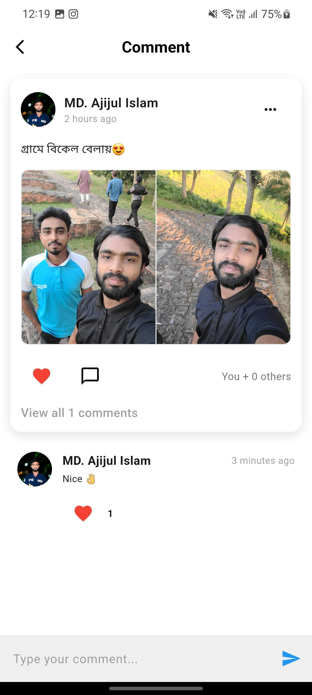</td>
      <td>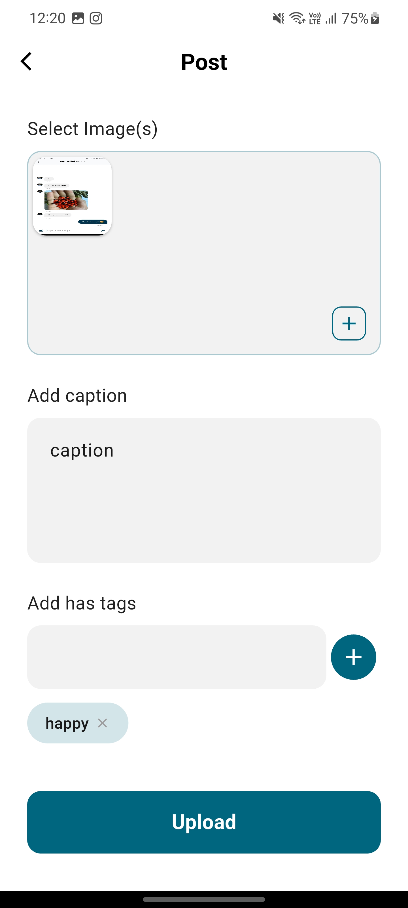</td>
      <td>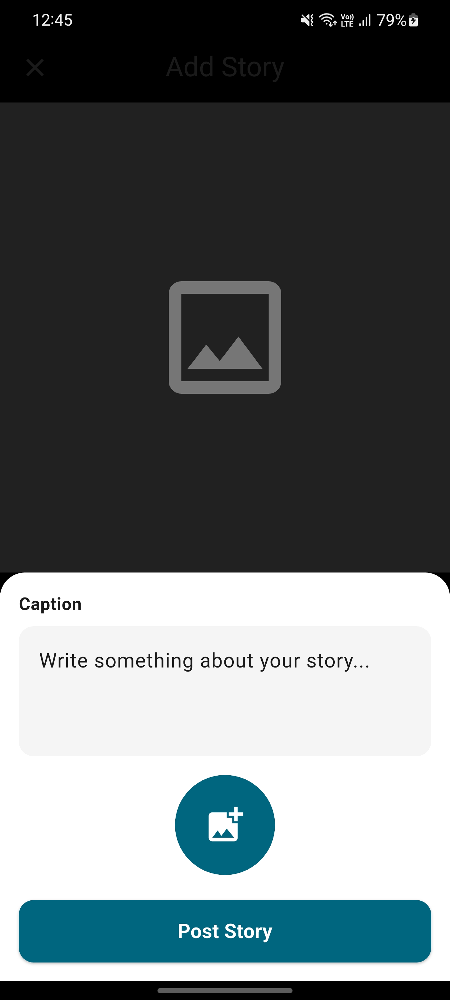</td>
    </tr>
    <tr>
      <td align="center"><strong>Story</strong></td>
      <td align="center"><strong>Chats</strong></td>
      <td align="center"><strong>Track car</strong></td>
    </tr>
    <tr>
      <td></td>
      <td>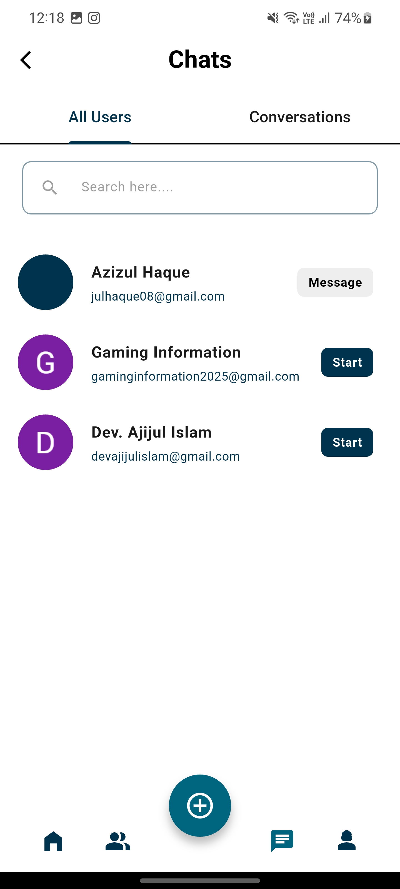</td>
      <td>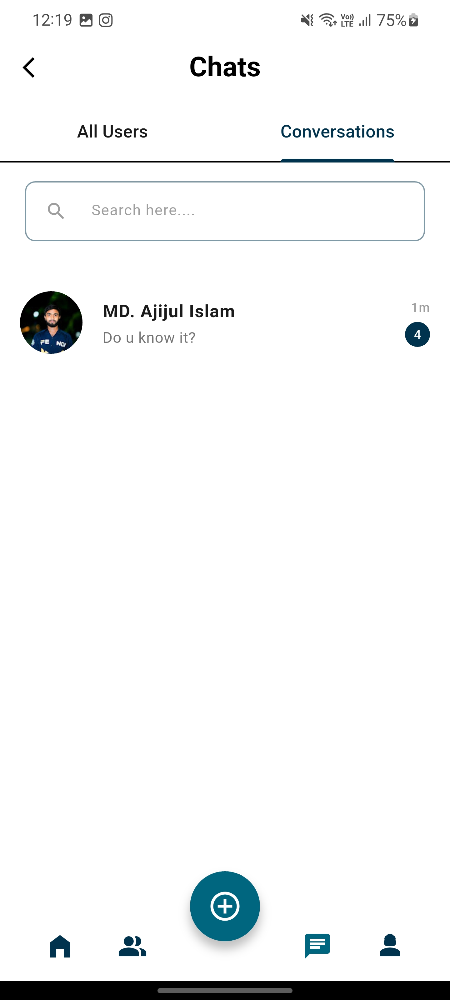</td>
    </tr>
    <tr>
      <td align="center"><strong>Profile</strong></td>
      <td align="center"><strong>Edit profile</strong></td>
      <td align="center"><strong>Friends</strong></td>
    </tr>
    <tr>
      <td>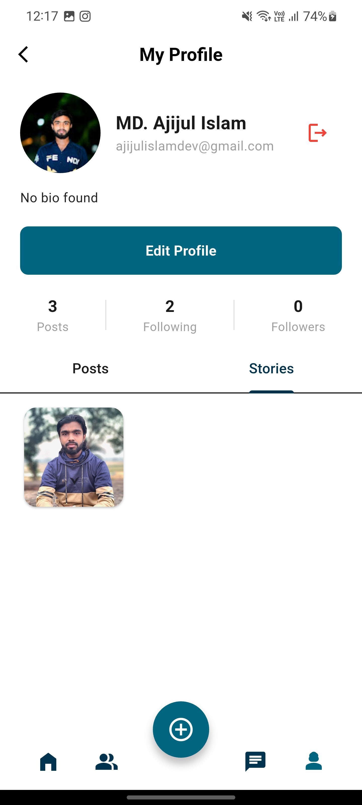</td>
      <td>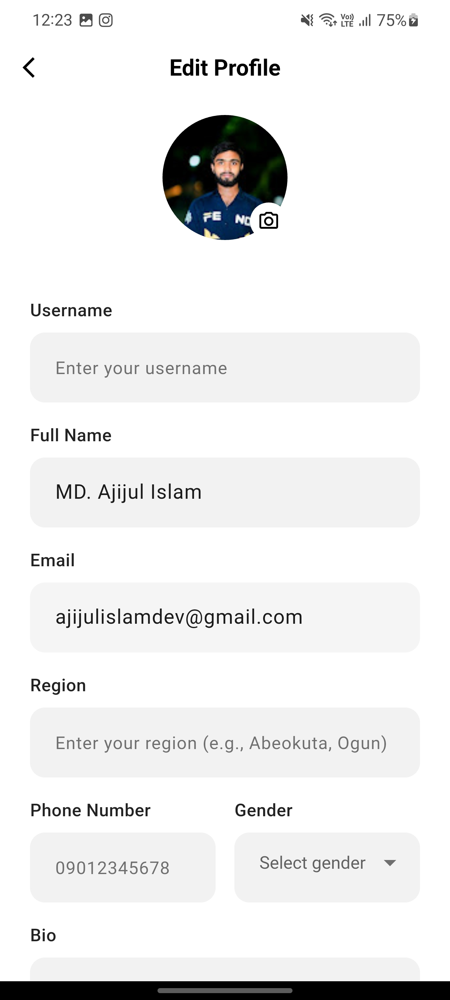</td>
      <td>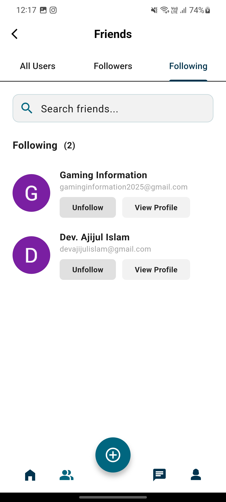</td>
    </tr>
  </table>
</div>

---

## ⚙️🧩 Installation & Setup

### 1. Clone Repository

```bash
git clone https://github.com/dev-ajijul-islam/friendzy_social_media_getx.git
cd friendzy
```

### 2. Install Dependencies

```bash
flutter pub get
```

### 3. Firebase Setup

* Create a Firebase project
* Enable Authentication (Email & Google)
* Enable Firestore Database
* Enable Firebase Storage
* Download `google-services.json` for Android and place it in `android/app`
* Download `GoogleService-Info.plist` for iOS and place it in `ios/Runner`

### 4. Run the App

```bash
flutter run
```

---

## 🔥🗄️ Firestore Database Structure

```text
users/
  userId/
    username
    bio
    photoUrl
    followers
    following
    postCount
    createdAt

posts/
  postId/
    userId
    caption
    imageUrl
    likes
    comments
    timestamp

stories/
  storyId/
    userId
    imageUrl
    views
    likes
    timestamp

chats/
  chatId/
    participants/
    messages/
```

---

## 🧪🧫 Testing

* Manual UI testing for all screens
* Firebase rules testing
* Authentication flow testing
* Real-time update testing

---

## 🌱🚀 Future Improvements

* Push notifications using Firebase Cloud Messaging
* Video posts and video stories
* Group chat system
* Dark mode support
* Post sharing feature
* User blocking and reporting system
* AI-based content moderation

---

## ⭐💖 Support

If you like this project, please give it a star on GitHub.
Your support helps me build and share more Flutter projects with the community.
